# AI_Doctor
# 背景介绍
* 什么是智能对话系统？
* 随着人工智能技术的发展, 聊天机器人, 语音助手等应用在生活中随处可见, 比如百度的小度, 阿里的小蜜, 微软的小冰等等. 其目的在于通过人工智能技术让机器像人类一样能够进行智能回复, 解决现实中的各种问题.

# 1 在线医生的总体架构
 
 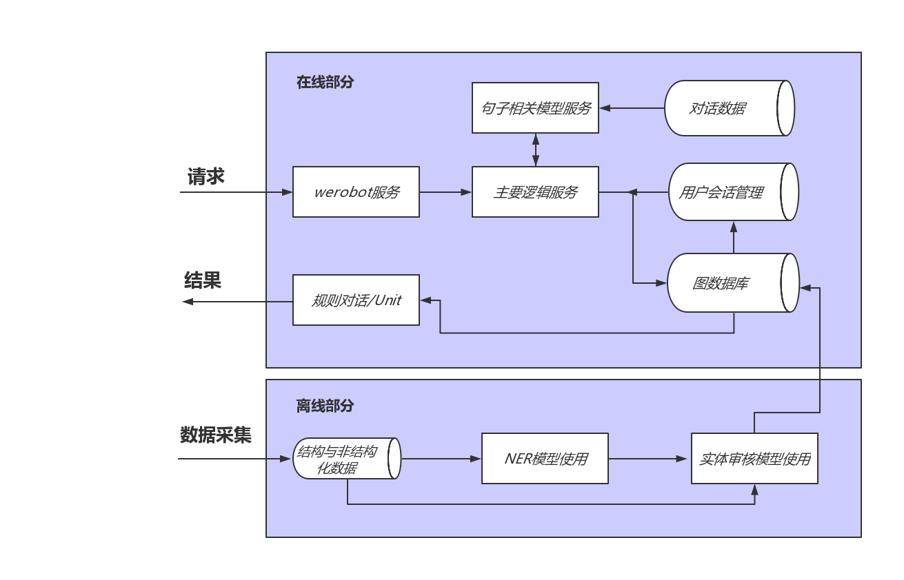
 
## 1.1 架构图分析:
### 整个项目分为: 在线部分和离线部分
* 在线部分包括: werobot服务模块, 主要逻辑服务模块, 句子相关模型服务模块, 会话管理模块(redis), 图数据库模块以及规则对话/Unit模块.
* 离线部分包括: 结构与非结构化数据采集模块, NER模型使用模块, 以及实体审核模型使用模块.
* 在线部分数据流: 从用户请求开始, 通过werobot服务, 在werobot服务内部请求主服务, 在主服务中将调用会话管理数据库redis, 调用句子相关模型服务, 以及调用图数据库, 最后将查询结果输送给对话规则模版或者使用Unit对话API回复.
* 离线部分数据流: 从数据采集开始, 将获得结构化和非结构化的数据, 对于结构化数据将直接使用实体审核模型进行审核, 然后写入图数据库; 对于非结构化数据, 将使用NER模型进行实体抽取, 然后通过实体审核后再写入图数据库.

# 2 neo4j数据库

## neo4j简介:
* neo4j是由Java实现的开源NoSQL图数据库.自从2003年开始研发, 到2007年发布第一版, 最新版本为3.3.5, neo4j现如今已经被各行各业的数十万家公司和组织采用.
* neo4j实现了专业数据库级别的图数据模型的存储. 与普通的图处理或内存级数据库不同, neo4j提供了完整的数据库特性, 包括ACID事物的支持, 集群支持, 备份与故障转移等. 这使其适合于企业级生产环境下的各种应用.

## 2.1 Cypher
### Cypher的基本命令和语法:
* create命令
* match命令
* merge命令
* relationship关系命令
* where命令
* delete命令
* sort命令
* 字符串函数
* 聚合函数
* index索引命令

# 3 离线部分
* 离线部分架构展开图:

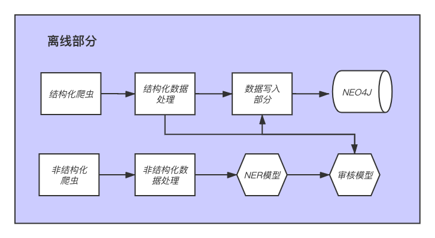
### 结构化数据流水线的组成部分:
* 结构化数据爬虫: 从网页上抓取结构化的有关医学命名实体的内容.
* 结构化数据的清洗: 对抓取的内容进行过滤和清洗, 以保留需要的部分.
* 命名实体审核: 对当前命名实体进行审核, 来保证这些实体符合我们的要求.
* 命名实体写入数据库: 将审核后的命名实体写入数据库之中, 供在线部分使用.

### 非结构化数据流水线的组成部分:
* 非结构化数据爬虫: 从网页上抓取非结构化的包含医学命名实体的文本.
* 非结构化数据清洗: 对非结构化数据进行过滤和清洗, 以保留需要的部分.
* 命名实体识别: 使用模型从非结构化文本中获取命名实体.
* 命名实体审核: 对当前命名实体进行审核, 来保证这些实体符合我们的要求.
* 命名实体写入数据库: 将审核后的命名实体写入数据库之中, 供在线部分使用.

## 3.1 命名实体审核任务
### 3.1.1 BERT中文预训练模型
* BERT中文预训练模型:
* BERT模型整体架构基于Transformer模型架构, BERT中文预训练模型的解码器和编码器具有12层, 输出层中的线性层具有768个节点, 即输出张量最后一维的维度是768. 它使用的多头注意力机制结构中, 头的数量为12, 模型总参数量为110M. 同时, 它在中文简体和繁体上进行训练, 因此适合中文简体和繁体任务.

* BERT中文预训练模型作用:
* 在实际的文本任务处理中, 有些训练语料很难获得, 他们的总体数量和包含的词汇总数都非常少, 不适合用于训练带有Embedding层的模型, 但这些数据中却又蕴含这一些有价值的规律可以被模型挖掘, 在这种情况下,使用预训练模型对原始文本进行编码是非常不错的选择, 因为预训练模型来自大型语料, 能够使得当前文本具有意义, 虽然这些意义可能并不针对某个特定领域, 但是这种缺陷可以使用微调模型来进行弥补.

### 3.1.2 构建RNN模型
* 传统RNN的内部结构图:

* 内部结构过程演示:

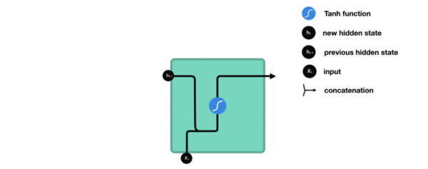

* 根据结构分析得出内部计算公式:

* 激活函数tanh的作用: 用于帮助调节流经网络的值, tanh函数将值压缩在-1和1之间.

#### 进行模型训练的步骤:
* 第一步: 构建随机选取数据函数.
* 第二步: 构建模型训练函数.
* 第三步: 构建模型验证函数.
* 第四步: 调用训练和验证函数.
* 第五步: 绘制训练和验证的损失和准确率对照曲线.
* 第六步: 模型保存.

* 训练和验证损失对照曲线:

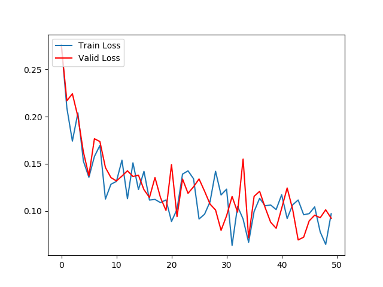

* 训练和验证准确率对照曲线:

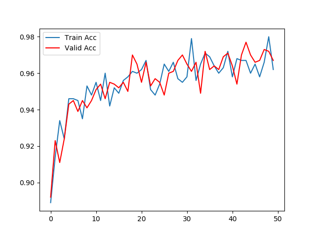
## 3.2 命名实体识别任务
### 什么是命名实体识别:
* 命名实体识别(Named Entity Recognition，NER)就是从一段自然语言文本中找出相关实体，并标注出其位置以及类型。是信息提取, 问答系统, 句法分析, 机器翻译等应用领域的重要基础工具, 在自然语言处理技术走向实用化的过程中占有重要地位. 包含行业, 领域专有名词, 如人名, 地名, 公司名, 机构名, 日期, 时间, 疾病名, 症状名, 手术名称, 软件名称等。具体可参看如下示例图：

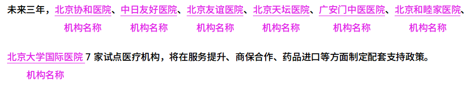

* 命名实体识别的作用:
* 识别专有名词, 为文本结构化提供支持.
* 主体识别, 辅助句法分析.
* 实体关系抽取, 有利于知识推理.

### 医学文本特征:

* 简短精炼
* 形容词相对较少
* 泛化性相对较小
* 医学名词错字率比较高
* 同义词、简称比较多
### 3.2.1 BiLSTM
* BiLSTM网络结构:
* 所谓的BiLSTM，就是(Bidirectional LSTM)双向LSTM. 单向的LSTM模型只能捕捉到从前向后传递的信息, 而双向的网络可以同时捕捉正向信息和反向信息, 使得对文本信息的利用更全面, 效果也更好.
* 在BiLSTM网络最终的输出层后面增加了一个线性层, 用来将BiLSTM产生的隐藏层输出结果投射到具有某种表达标签特征意义的区间, 具体如下图所示：
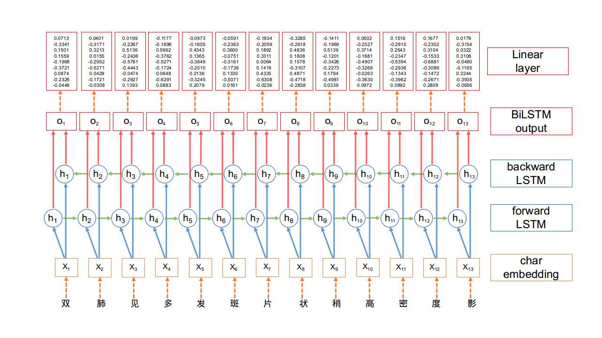

### 3.2.2 CRF
#### CRF的概念和作用:
* CRF(全称Conditional Random Fields), 条件随机场. 是给定输入序列的条件下, 求解输出序列的条件概率分布模型.
* 基本定义: 我们将随机变量的集合称为随机过程. 由一个空间变量索引的随机过程, 我们将其称为随机场. 上面的例子中, 做词性标注时, 可以将{名词、动词、形容词、副词}这些词性定义为随机变量, 然后从中选择相应的词性, 而这组随机变量在某种程度上遵循某种概率分布, 将这些词性按照对应的概率赋值给相应的词, 就完成了句子的词性标注.
#### 关于条件随机场与马尔科夫假设:
* 马尔科夫假设前位置的取值只和与它相邻的位置的值有关, 和它不相邻的位置的值无关.
* 词性标注例子中, 可以理解为当前词的词性是根据前一个词和后一个词的词性来决定的, 等效于从词性前后文的概率来给出当前词的词性判断结果.
* 现实中可以做如下假设: 假设一个动词或者副词后面不会连接同样的动词或者副词, 这样的概率很高. 那么, 可以假定这种给定隐藏状态(也就是词性序列)的情况下, 来计算观测状态的计算过程. 本质上CRF模型考虑到了观测状态这个先验条件, 这也是条件随机场中的条件一词的含义.

### 3.2.3 BiLSTM+CRF模型
#### BiLSTM+CRF模型结构:
* 1, 模型的标签定义与整体架构
* 2, 模型内部的分层展开
* 3, CRF层的作用

#### 1, 模型的标签定义与整体架构: 假设我们的数据集中有两类实体-人名, 地名, 与之对应的在训练集中有5类标签如下所示:
* B-Person, I-Person, B-Organization, I-Organization, O
*  B-Person: 人名的开始
*  I-Person: 人名的中间部分
*  B-Organization: 地名的开始
*  I-Organization: 地名的中间部分
*  O: 其他非人名, 非地名的标签

* 假设一个句子有5个单词构成, (w0, w1, w2, w3, w4), 每一个单元都代表着由字嵌入构成的向量. 其中字嵌入是随机初始化的, 词嵌入是通过数据训练得到的, 所有的嵌入在训练过程中都会调整到最优解.

* 这些字嵌入或词嵌入作为BiLSTM+CRF模型的输入, 而输出的是句子中每个单元的标签.
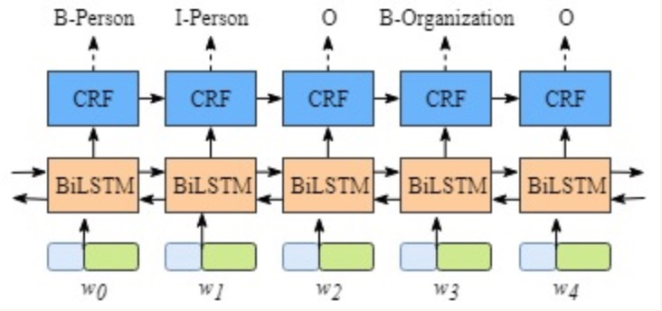

#### 2, 模型内部的分层展开: 整个模型明显有两层, 第一层是BiLSTM层, 第二层是CRF层, 将层的内部展开如下图所示:
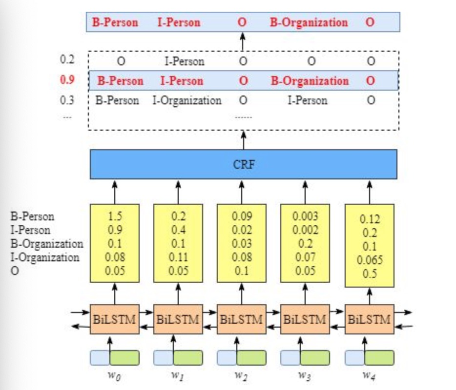

#### 3, CRF层的作用: 如果没有CRF层, 也可以训练一个BiLSTM命名实体识别模型, 如下图所示:
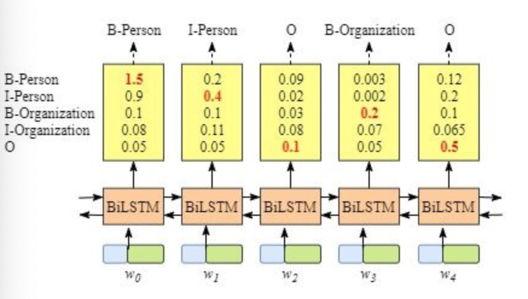

* 由于BiLSTM的输出为单元的每一个标签分值, 我们可以挑选分值最高的一个作为该单元的标签.例如, 对于单词w0, "B-Person"的分值-1.5是所有标签得分中最高的, 因此可以挑选"B-Person"作为单词w0的预测标签. 同理, 可以得到w1 - "I-Person", w2 - "O", w3 - "B-Organization", w4 - "O"

* 虽然按照上述方法, 在没有CRF层的条件下我们也可以得到x中每个单元的预测标签, 但是不能保证标签的预测每次都是正确的. 如果出现下图的BiLSTM层输出结果, 则明显预测是错误的.
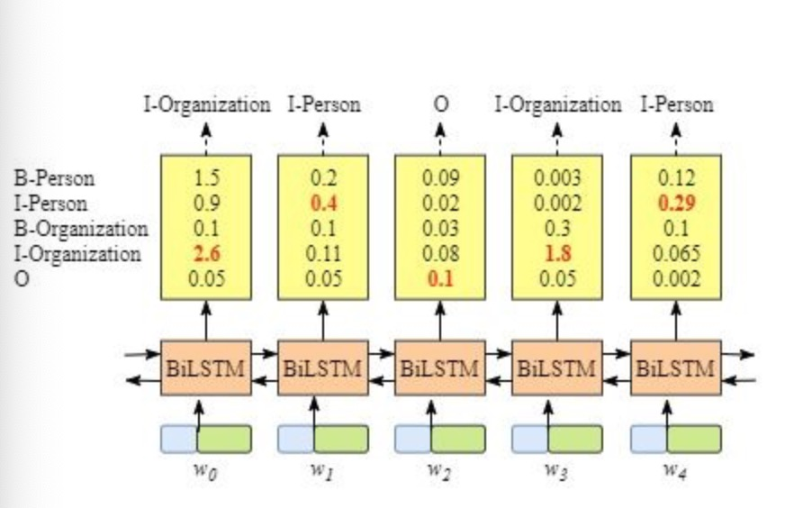

* CRF层能从训练数据中获得约束性的规则.
* CRF层可以为最后预测的标签添加一些约束来保证预测的标签是合法的. 在训练数据训练的过程中, 这些约束可以通过CRF层自动学习到.

* 1: 句子中的第一个词总是以标签"B-"或者"O"开始, 而不是"I-"开始.
* 2: 标签"B-label1 I-label2 I-label3 ......", 其中的label1, label2, label3应该属于同一类实体. 
* 比如, "B-Person I-Person"是合法的序列, 但是"B-Person I-Organization"是非法的序列.
* 3: 标签序列"O I-label"是非法序列, 任意实体标签的首个标签应该是"B-", 而不是"I-".
* 比如, "O B-label"才是合法的序列

* 有了上述这些约束, 标签序列的预测中非法序列出现的概率将会大大降低.

#### 损失函数的定义:
* BiLSTM层的输出维度是tag_size, 也就是每个单词w_i映射到tag的发射概率值, 假设BiLSTM的输出矩阵是P, 其中P(i,j)代表单词w_i映射到tag_j的非归一化概率. 对于CRF层, 假设存在一个转移矩阵A, 其中A(i,j)代表tag_j转移到tag_i的概率.

* 对于输入序列X对应的输出tag序列y, 定义分数如下(本质上就是发射概率和转移概率的累加和):
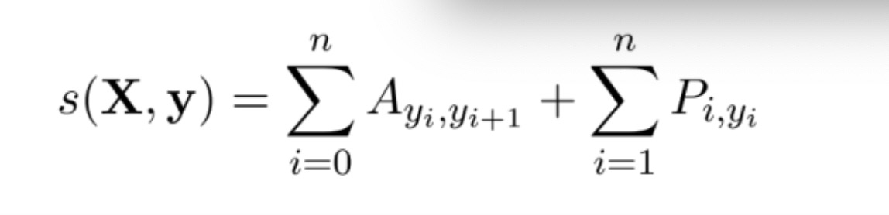

* 利用softmax函数, 为每一个正确的tag序列y定义一个概率值, 在真实的训练中, 只需要最大化似然概率p(y|X)即可, 具体使用对数似然如下:
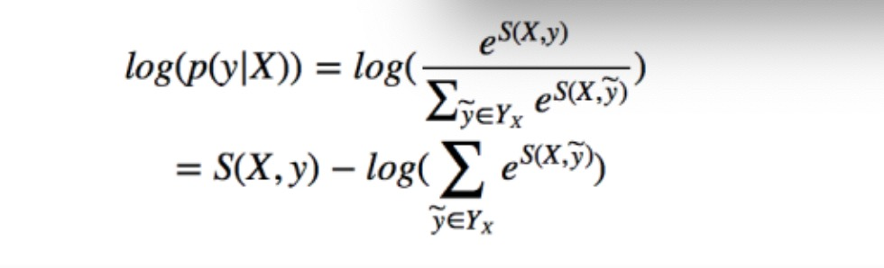

* BiLSTM+CRF模型的实现:
* 第一步: 构建神经网络
* 第二步: 文本信息张量化
* 第三步: 计算损失函数第一项的分值
* 第四步: 计算损失函数第二项的分值
* 第五步: 维特比算法的实现
* 第六步: 完善BiLSTM_CRF类的全部功能

* 训练和验证召回率对照曲线:

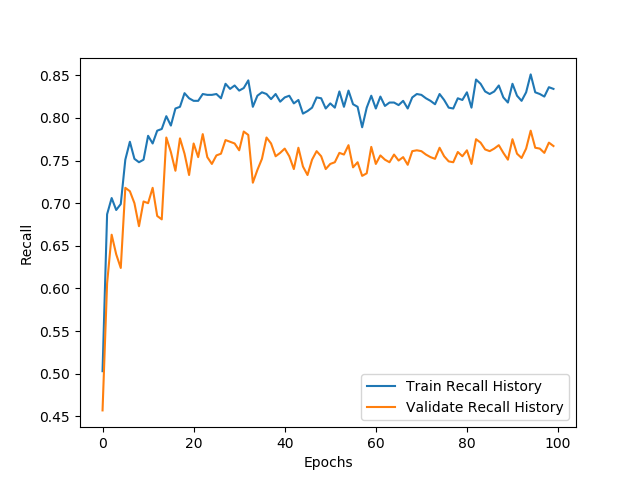
* 训练和验证F1值对照曲线:

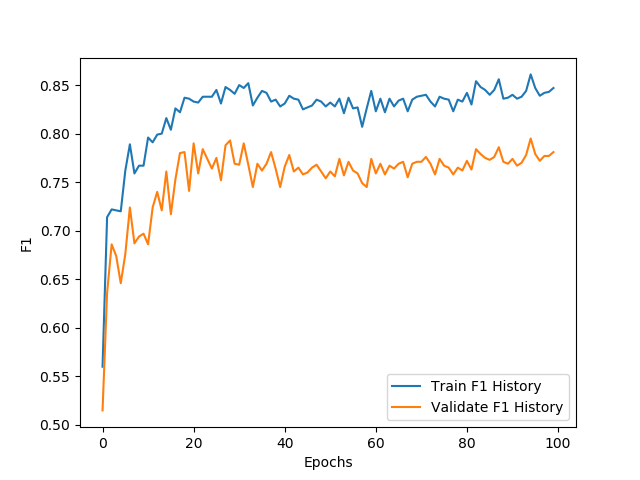

# 4 在线部分
* 在线部分架构图:

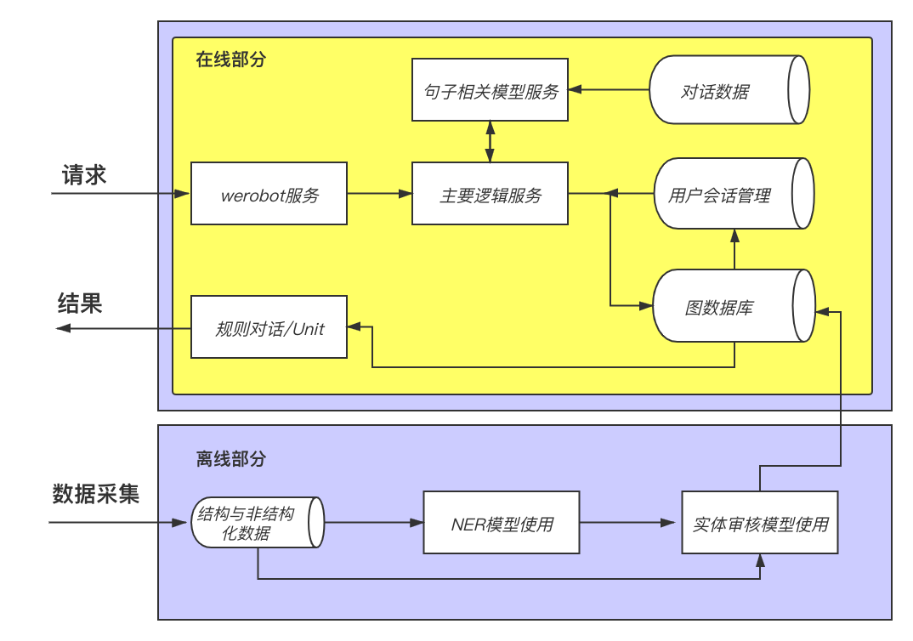
#### 在线部分简要分析:
* 根据架构图，在线部分的核心由三个服务组成，分别是werobot服务，主要逻辑服务，句子相关模型服务. 这三个服务贯穿连接整个在线部分的各个模块.
#### werobot服务作用:
* 用于连接微信客户端与后端服务, 向主要逻辑服务发送用户请求，并接收结构返回给用户.
#### 主要逻辑服务作用:
* 用于处理核心业务逻辑, 包括会话管理，请求句子相关模型服务，查询图数据库，调用Unit API等.
#### 句子相关模型服务:
* 用于封装训练好的句子相关判断模型, 接收来自主要逻辑服务的请求, 返回判断结果.

## 4.1 werobot服务构建
### werobot服务的构建过程可分为四步:
* 第一步: 获取服务器公网IP
* 第二步: 配置微信公众号
* 第三步: 使用werobot启动服务脚本
* 第四步: 使用微信公众号进行测试

## 4.2 主要逻辑服务
* 主要逻辑图:

* 逻辑图分析:

* 主要逻辑服务接收werobot发送的请求后，根据用户id查询redis查找用户上一次说过的话，根据结果判断是否为他的第一句.
* 如果是第一句话，直接查询数据库，判断句子中是否包含症状实体，并返回该症状连接的疾病，并填充在规则对话模版中，如果查询不到则调用Unit API返回结果.
* 如果不是该用户的第一句话,则连同上一句话的内容一起请求句子相关模型服务，判断两句话是否讨论同一主题,如果是,则继续查询图数据库，如果不是，使用unit api返回结果.

### 构建主要逻辑服务的步骤:
* 第一步: 导入必备工具和配置
* 第二步: 完成查询neo4j数据库的函数
* 第三步: 编写主要逻辑处理类
* 第四步: 编写服务中的主函数
* 第五步: 使用gunicorn启动服务
* 第六步: 编写测试脚本并进行测试:

## 4.3 句子主题相关任务
* 句子主题相关任务:
* 在多轮对话系统中, 往往需要判断用户的最近两次回复是否围绕同一主题, 来决定问答机器人是否也根据自己上一次的回复来讨论相关内容. 在线医生问答过程中, 同样需要这样的处理, 确保用户一直讨论疾病有关的内容, 来根据症状推断病情. 这种任务的形式与判断两个句子是否连贯的形式相同, 他们都需要输入两段文本内容, 返回'是'或'否'的二分类标签.

* 选用的模型及其原因:
* 对话系统是开放的语言处理系统, 可能出现各种文字, 当我们的训练集有限无法覆盖大多数情况时, 可以直接使用预训练模型进行文字表示. 我们这里使用了bert-chinese预训练模型, 同时为了适应我们研究的垂直领域, 我们在后面自定义浅层的微调模型, 它将由两层全连接网络组成, 之后我们会详细介绍.

* 进行模型训练的步骤:
* 第一步: 构建数据加载器函数.
* 第二步: 构建模型训练函数.
* 第三步: 构建模型验证函数.
* 第四步: 调用训练和验证函数并打印日志.
* 第五步: 绘制训练和验证的损失和准确率对照曲线.
* 第六步: 模型保存.

* 训练和验证损失对照曲线:

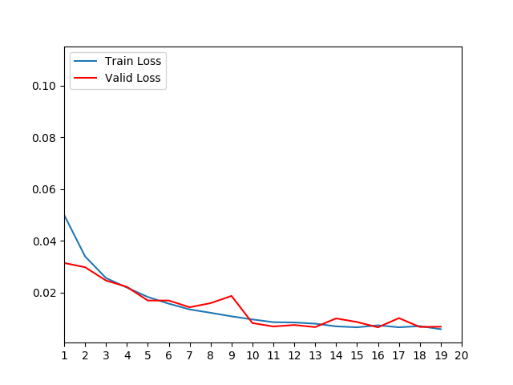

* 训练和验证准确率对照曲线:

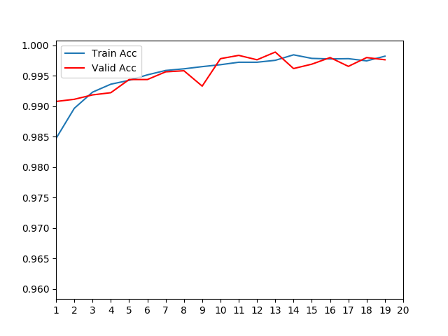

